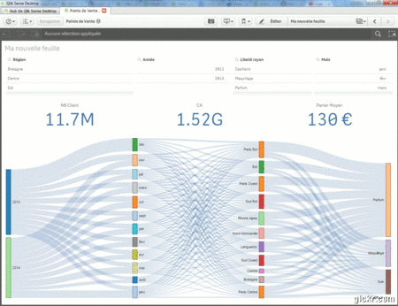

# SenseSankey
Qlik Sense Sankey Extension

Developed by Xavier Le Pitre, based on D3.js

Display data with Sankey diagram.
Typically used to visualize cost, energy or flows between processes. Helpful in locating dominant contributions to an overall flow. 
The size of each flow is calculated by the value.

The extension is based on :

Original radar chart extension, developped by John Park : <a href="http://branch.qlik.com/#/project/56728f52d1e497241ae697c5">here</a> 
Mike Bostock's Sankey chart : <a href="http://bost.ocks.org/mike/sankey">here</a> 
D3.js

V1.3 Add new option for persistent colors

V1.3.1 Correct data with commas + Choice of device symbol.

